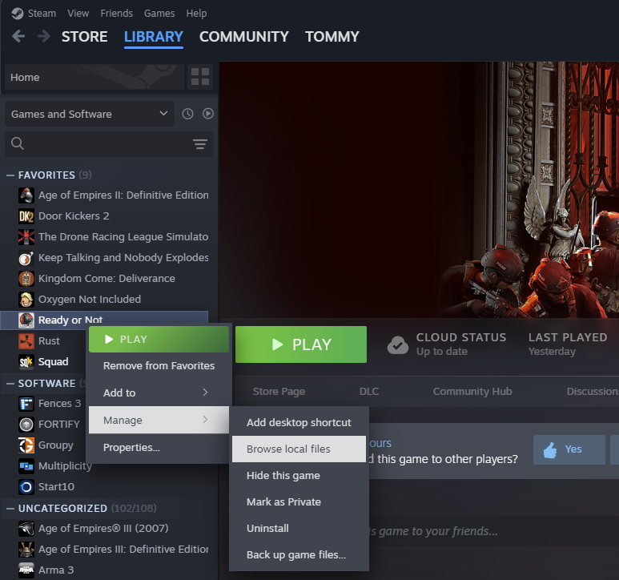

# Ready or Not AI Settings Mod

## Prerequisities

* UnrealPak.exe (packed in this repo) or Unreal Engine 5.3.2 *(It's important to use the same version as the game was built with)*

## How to use

* Open `F:\Root\GIT\ReadyOrNot_AISettingsMod\src\pakchunk99-AISettings_P\Config\Difficulties\Test.ini` with a text editor or create your own difficulty ini file
* Edit the settings as you like
* Build and install
* In game select the difficulty you modified or created

## Building

* Run `update_shortcut.bat`
* Drag `pakchunk99-AISettings_P` folder to the `pak.bat - Shortcut`
* Move the created pak file to Ready or Not Paks folder e.g. `F:\SteamLibrary\steamapps\common\Ready Or Not\ReadyOrNot\Content\Paks\mymods`

## Installation

* In Steam, right click Ready or Not -> Manage -> Browse local files

* Then go to `.\Ready Or Not\ReadyOrNot\Content\Paks`
* Create a folder named `mymods` if it does not exist
* Move the created pak file from the building step to the `mymods` folder

## Hints

* UE5 binaries directory `F:\Other\Epic Games\UE_5.3\Engine\Binaries\Win64`